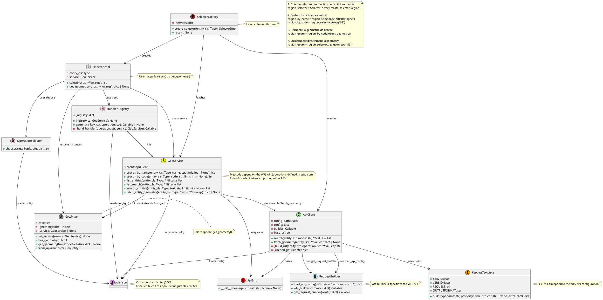

# GeoSelector

## Overview

`geoselector` is a **generic API client framework** for interacting with any WFS‑like (Web Feature Service) geographic data source. It provides a high‑level, type‑safe selector API that abstracts request building, caching, error handling, and logging, allowing developers to focus on business logic rather than low‑level HTTP details.

## Project Structure

```text
geoselector/
├── __init__.py
├── core/
│   ├── __init__.py
│   ├── api_client.py
│   ├── selector.py
│   ├── service.py
│   ├── operation_selector.py
│   ├── handler_registry.py
│   ├── request_builder.py
│   └── request_template.py
├── config/
│   ├── __init__.py
│   ├── apis.json
│   └── README.md
└── logging_config.py

tests/
└── test_all.py
README.md
pyproject.toml
requirements.txt
```

## What `geoselector` Offers

- **Generic API client** – [`geoselector/core/api_client.py`](geoselector/core/api_client.py) reads a JSON configuration file ([`geoselector/config/apis.json`](geoselector/config/apis.json)) that describes any WFS‑like service (endpoints, parameters).
- **Selector** – [`geoselector/core/selector.py`](geoselector/core/selector.py) builds requests for a given entity class, applies an LRU cache (`functools.lru_cache`), and returns raw JSON structures.
- **Operation selector**, **handler registry**, and **service** layers – enable adding new entities without writing new request code. See [`geoselector/core/operation_selector.py`](geoselector/core/operation_selector.py), [`geoselector/core/handler_registry.py`](geoselector/core/handler_registry.py), and [`geoselector/core/service.py`](geoselector/core/service.py).
- **Centralised logging** – configured via [`geoselector/logging_config.py`](geoselector/logging_config.py).
- **Error handling** – unified `ApiError` exception hierarchy.
- **Raw geometry output** – returns GeoJSON dictionaries; conversion to `QgsGeometry` (or other GIS libraries) is left to the caller.

## Installation

> **Note**: The package is currently under active development. Install from the repository for the latest features:
>
> ```bash
> git clone https://github.com/yan-sln/geoselector.git
> cd geoselector
> pip install -e .
> ```

## Configuration

The core client reads its service definitions from **`geoselector/config/apis.json`**. A minimal example:

```json
{
  "base_url": "https://data.geopf.fr/wfs/ows",
  "api_type": "wfs",
  "common": {
    "SERVICE": "WFS",
    "VERSION": "2.0.0",
    "REQUEST": "GetFeature",
    "OUTPUTFORMAT": "application/json"
  },
  "entities": {
    "region": {
      "TYPENAME": "LIMITES_ADMINISTRATIVES_EXPRESS.LATEST:region",
      "search_by_name": {
        "PROPERTYNAME": "nom_officiel,code_insee",
        "CQL_FILTER": "nom_officiel ILIKE '{value}%'"
      },
      "search_by_code": {
        "PROPERTYNAME": "nom_officiel,code_insee",
        "CQL_FILTER": "code_insee ILIKE '{value}%'"
      },
      "geometry": {
        "PROPERTYNAME": "geometrie",
        "CQL_FILTER": "code_insee='{value}'"
      }
    }
  }
}
```

Add or modify entries to match your data source. The framework will automatically generate request URLs based on the configuration. For a detailed explanation of the JSON structure and how to add another API, see the configuration guide in [`geoselector/config/README.md`](geoselector/config/README.md).

## Core Components

| Component | Description | Key File |
|-----------|-------------|----------|
| **API Client** | Low‑level HTTP wrapper that loads the JSON config and performs GET/POST calls. Handles retries and basic error mapping. | [`geoselector/core/api_client.py`](geoselector/core/api_client.py) |
| **Selector** | High‑level façade exposing `select` and `get_geometry` methods for a given entity class. Utilises caching for repeated queries. | [`geoselector/core/selector.py`](geoselector/core/selector.py) |
| **Operation Selector** | Maps entity operations (search, fetch geometry) to concrete request templates. | [`geoselector/core/operation_selector.py`](geoselector/core/operation_selector.py) |
| **Handler Registry** | Registry pattern that stores operation handlers, making the system extensible without modifying core code. | [`geoselector/core/handler_registry.py`](geoselector/core/handler_registry.py) |
| **Service Layer** | Orchestrates the API client and operation selector, providing a clean service‑oriented API. | [`geoselector/core/service.py`](geoselector/core/service.py) |
| **Logging Config** | Centralised `logging` configuration used throughout the package. | [`geoselector/logging_config.py`](geoselector/logging_config.py) |

## Diagram




## Quick Usage Example

```python
from geoselector.core.selector import Selector
from geoselector.core.entities import Commune

# Initialise a selector for the Municipality entity
selector = Selector(Commune)

# Search for municipalities matching a text query
results = selector.select("Paris")
print(f"Found {len(results)} results")

# Retrieve raw geometry (GeoJSON) for the first result
geometry = results[0].get_geometry()
print("Geometry (GeoJSON):", geometry)
```

## Extensibility

- **New Services** – Add a new entry to `apis.json` and, if necessary, implement a custom request template in [`geoselector/core/request_template.py`](geoselector/core/request_template.py).
- **New Entities** – Subclass `GeoEntity` (found in [`geoselector/core/entities.py`](geoselector/core/entities.py)) and set `API_ENDPOINT`. The selector will handle it out‑of‑the‑box.
- **Custom Handlers** – Register a custom operation handler via the `HandlerRegistry` to override default behaviour for a specific service.

## Future Developments

- Logging in `logging_config.py` configures the root logger, which may affect other libraries; consider using a module‑specific logger.
- Déplacer fichier des logs qui se met à la racine utilisateur pour le moment ?
- Ajouter les tests pertinents.
- Question taille max du cache pour les GeoEntity.
- Push ./scripts/validate_config.py qui permet de s'assurer qu'apis.json est bien formé pour l'architecture.
- `OperationSelector.choose` contains several nested conditionals; could be refactored for readability. Refactor OperationSelector: Extract heuristics into separate helper functions to simplify the choose method.
- Ajouter sécurité pour dire lorsque paramètre de recherche d'un GeoEntity incorrect, au lieu de mettre des champs à None !
- Etendre ApiError : envelopper les appels du service (GeoService, SelectorImpl) dans des blocs try/except ApiError afin de fournir des messages d’erreur plus conviviaux ou de déclencher des mécanismes de retry.
- Ajouter limiteur de requête en fonction API : Diffusion d'objets WFS = 30 requêtes/s +ajouter dans le readme : https://geoservices.ign.fr/documentation/services/limite-d-usage + disponibilité : https://geoservices.ign.fr/documentation/services/disponibilite
- Voir si faire de GeoService un singleton.
- Finir de compléter config/README.md et traduire en anglais.
- S'assurer du bon contrôle des types tout au long de l'architecture. Nota :
    - core/selector.py – _build_filter Retourne Dict[str, Any] avec des valeurs provenant directement de args. Aucun cast ni validation. Si un argument est None ou un type inattendu, le filtre envoyé au serveur peut être invalide.
    - core/service.py – search_entities Utilise re.sub pour convertir le nom de classe en clé, mais ne vérifie pas que la clé existe dans la configuration. KeyError ou appel à une opération inexistante, capturé mais masqué par un print.
- `SelectorImpl.select` raises generic `ValueError` for missing arguments; could use a custom exception for clarity.
- Vérifier le parcours de geometry d'une entité après list select ; par exemple : dès que plus qu'un élément dans la liste, on récupère la géométrie.
